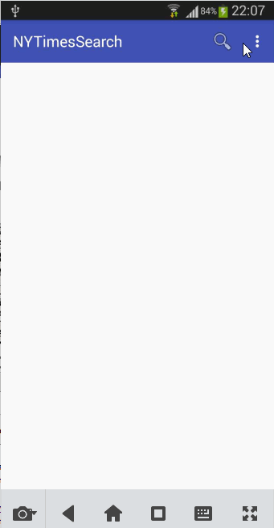

## New York Times Article Search

New York Times News Search article app which allows a user to find old articles.

Time spent: About 14 hours

### Features

#### Required

- [x] User can enter a search query that will display a grid of news articles using the thumbnail and headline from the New York Times Search API.
- [x] User can click on "settings" which allows selection of advanced search options to filter results.
- [x] User can configure advanced search filters such as:
		* Begin Date (using a date picker)
		* News desk values (Arts, Fashion & Style, Sports)
		* Sort order (oldest or newest)
- [x] Subsequent searches will have any filters applied to the search results.(add End Date filter)
- [x] User can tap on any article in results to view the contents in an embedded browser.
- [x] User can scroll down "infinitely" to continue loading more news articles. The maximum number of articles is limited by the API search. 

#### Optional
- [x] Advanced: Robust error handling, check if internet is available, handle error cases, network failures.
- [x] Advanced: Replace Filter Settings Activity with a lightweight modal overlay.(apply for date time Piker, use DatePickerDialog)
- [x] Advanced: Use the ActionBar SearchView or custom layout as the query box instead of an EditText.
- [x] Advanced: User can share a link to their friends or email it to themselves.
- [x] Advanced: Improve the user interface and experiment with image assets and/or styling and coloring
- [x] Bonus: Use the RecyclerView with the StaggeredGridLayoutManager to display improve the grid of image results

### Walkthrough

