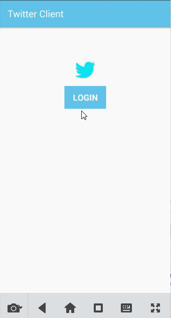

# Project 3 - *TweetsClient*

**TweetsClient** is an android app that allows a user to view his Twitter timeline and post a new tweet. The app utilizes [Twitter REST API](https://dev.twitter.com/rest/public).

Time spent: **20** hours spent in total

## User Stories

The following **required** functionality is completed:

* [x]	User can **sign in to Twitter** using OAuth login
* [x]	User can **view tweets from their home timeline**
  * [x] User is displayed the username, name, and body for each tweet
  * [x] User is displayed the [relative timestamp](https://gist.github.com/nesquena/f786232f5ef72f6e10a7) for each tweet "8m", "7h"
  * [x] User can view more tweets as they scroll with [infinite pagination](http://guides.codepath.com/android/Endless-Scrolling-with-AdapterViews-and-RecyclerView). Number of tweets is unlimited.
    However there are [Twitter Api Rate Limits](https://dev.twitter.com/rest/public/rate-limiting) in place.
* [x] User can **compose and post a new tweet**
  * [x] User can click a “Compose” icon in the Action Bar on the top right
  * [x] User can then enter a new tweet and post this to twitter
  * [x] User is taken back to home timeline with **new tweet visible** in timeline

## Video Walkthrough 

Here's a walkthrough of implemented user stories:

GIF created with [LiceCap](http://www.cockos.com/licecap/).

## Notes

Describe any challenges encountered while building the app.

## Open-source libraries used

- [Android Async HTTP](https://github.com/loopj/android-async-http) - Simple asynchronous HTTP requests with JSON parsing
- [Picasso](http://square.github.io/picasso/) - Image loading and caching library for Android
